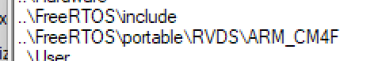

# CubeMonitor
### 下载链接
https://link.zhihu.com/?target=https%3A//www.st.com/en/development-tools/stm32cubemonitor.html **（需要ST账号）**
### 1.配置myVariables（我的变量）
这里很多内容默认，只讲述重点需要修改的内容。
**第一步**

**第二步**

    点击图中“更新”之后，再次“完成”即可。

提示：这里可支持elf、out或axf扩展名的文件，我这里使用MDK生成的axf文件。
你要做的主要就是指定你在单片机上运行的可执行文件(xxx.elf)，STM32CubeMonitor会自动分析该可执行文件中可监控的变量，你只需要选中你想要观察的变量即可。实际上这些变量是通过访问地址指定的，**例如你有一个变量uint32_t myvar[3]，而自动分析出来的变量列表里可能只列出了my_var[0]，那么你只需要手动添加my_var[1]和my_var[2]并且在my_var[0]地址的基础上分别偏移4个byte和8个byte即可。**
***如图所示***

### 2.配置myProbe_Out
这里需要提前准备好硬件，并连接电脑。比较简单，选择就行了。如果没有出现设备，请检查板子，或者连接是否正常。

接下来几个节点的配置比较简单，简单用图片给展示一下。
### 3.配置myProbe_In

### 4.配置processing节点

### 5.启动图形监测界面
上面节点配置好之后，点击右上角的【DASHBOARD】就会弹出“Chart”图形监测界面。

### 6.启动监测
点击界面中的“START ACQUISITION”按钮，就会启动监测

### 参考资料
- https://blog.csdn.net/xingsongyu/article/details/115867014
- https://zhuanlan.zhihu.com/p/448582591