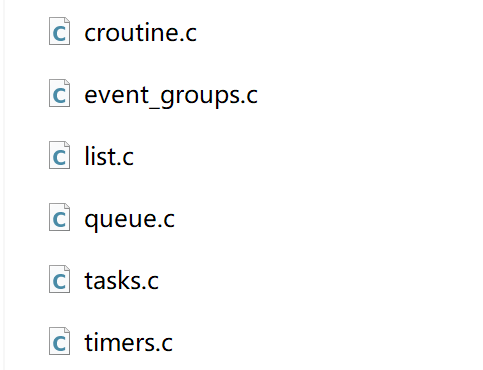
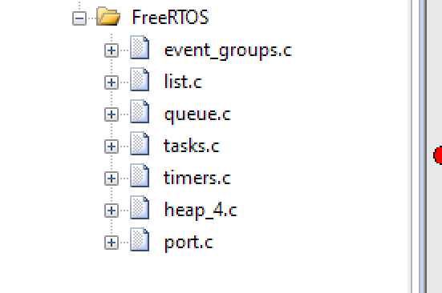
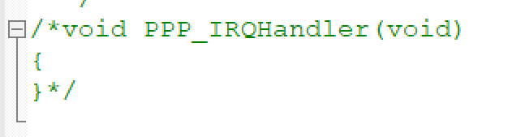
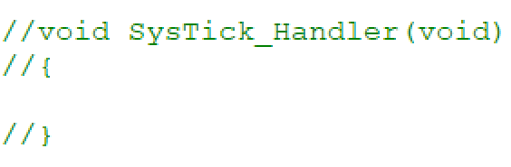
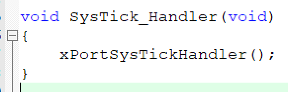
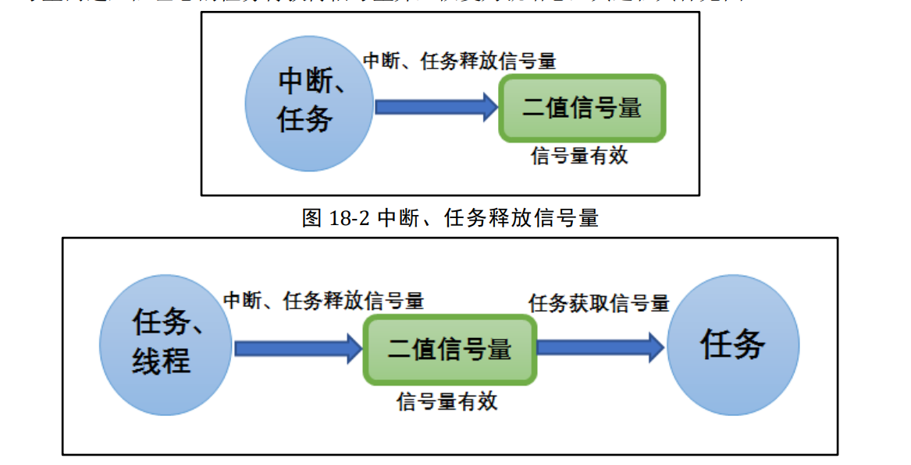

# 第一章
- pdTRUE == pdPASS == 1
- pdFALSE == pdFAIL == 0
# 第三章
    裸机系统与多任务系统
## 1 裸机系统
### 1.1 轮询系统
- 初始化硬件
- 主程序在死循环中运行
- 需要检测外部信号时，实时响应能力不佳
- 只适合顺序执行的功能代码
### 1.2 前后台系统
- 在轮询基础上加入了***中断***
- 外部事件响应在中断中完成
- 中断 == 前台；main（）中无限循环 == 后台；
## 2.多任务系统
- 事件响应为中断。但在中断中如果出现**更高优先级**的中断，将会打断当前中断
- 事件处理在任务中进行，不用考虑每个功能模块之间的干扰，方便编程
- 系统会占据少量FLASH和RAM
# 第四章
    数据结构——列表与列表项
**FreeRTOS中链表节点数据结构**
```c
struct xLIST_ITEM
{
    listFIRST_LIST_ITEM_INTEGRITY_CHECK_VALUE           
    configLIST_VOLATILE TickType_t xItemValue;          /* 用于辅助排序的值，当
#define configUSE_16_BIT_TICKS			0 当设置为0时，TickType_t表示32位 */
    struct xLIST_ITEM * configLIST_VOLATILE pxNext;     //下一个节点
    struct xLIST_ITEM * configLIST_VOLATILE pxPrevious; //上一个节点   
    void * pvOwner;                                     //指向该节点拥有者，在哪个数据结构中，属于哪个数据结构成员
    struct xLIST * configLIST_VOLATILE pxContainer;     //指向该节点所在链表，通常指向根节点
    listSECOND_LIST_ITEM_INTEGRITY_CHECK_VALUE          
};    
typedef struct xLIST_ITEM ListItem_t;                   /* For some reason lint wants this as two separate definitions. */
```
```c
void vListInitialiseItem( ListItem_t * const pxItem ) PRIVILEGED_FUNCTION;    //链表节点初始化
void vListInitialise( List_t * const pxList ) PRIVILEGED_FUNCTION;            //链表根节点初始化
void vListInsertEnd( List_t * const pxList,
                     ListItem_t * const pxNewListItem ) PRIVILEGED_FUNCTION;  //将节点插入链表的尾部
void vListInsert( List_t * const pxList,
                  ListItem_t * const pxNewListItem ) PRIVILEGED_FUNCTION;     //将节点按照升序排列插入链表
UBaseType_t uxListRemove( ListItem_t * const pxItemToRemove ) PRIVILEGED_FUNCTION;
                                                                              //将节点从链表中删除

```
# 第五章
    任务的定义与任务切换
- 每个任务互相独立、互不干扰
- 需要分配空间，预先定义好的全局数组（静态）或是动态分配的内存空间（动态）
- 任务启动调度器由
```c
vTaskStartScheduler()
```
### 前十章为内核讲解，不在过多记笔记，可以直接看书

# 第十一章
    移植FreeRTOS到STM32
### 1.使用RM空工程作为裸机工程模板
### 2.下载FreeRTOS源码
- https://www.freertos.org/zh-cn-cmn-s/
### 3.将FreeRTOS源码复制到裸机工程中
- 
- 
- 
### 4.在keil中添加头文件包含路径和源码文件
- 
- 
### 5.在FreeRTOSConfig.h中修改
- 
- 
- 
### 6.修改stm32f4xx_it.c
- 
- 
- 
- 


**此时进行编译,通过**

    但在下载验证时,发现系统未正常启动,卡死在SysTick_Handle;
    
    在谷歌上搜索,发现需修改SysTick_Handle();


修改后下载验证成功
# 第十二章
    任务
### 动态创建任务
- 任务使用的栈和任务控制块是在创建任务时由FreeRTOS动态分配
- 内存管理在heap_4.c文件中
```c
//定义任务函数
void LEDblue_Task(void *parameter)
{
	while(1)
	{
		led_blue_toggle();
		vTaskDelay(200);
	}
}
//预先为任务栈定义一个任务控制块指针
static TaskHandle_t led1task_Handle = NULL;
//定义任务栈大小,单位为字,一个字等于4字节
#define LED1_TASK_STACK_SIZE 128
//定义任务优先级    在FreeRTOS中数字越大优先级越高,0代表最低优先级
#define LED1_TASK_PRIO 2
//动态任务创建
xTaskCreate((TaskFunction_t)LEDblue_Task,
			(const char*)"led1_task",
			(uint16_t)LED1_TASK_STACK_SIZE,
			(void *)NULL,
			(UBaseType_t)LED1_TASK_PRIO,
			(TaskHandle_t*)&led1task_Handle);
//启动任务调度
vTaskStartScheduler();
```
# 第十三章
    FreeRTOS的启动流程
### RTOS启动流程
1. "万事具备,只欠东风"
- 万事:硬件初始化+RTOS初始化+所有任务创建完毕
- 东风:启动任务调度
2. "小心翼翼,十分谨慎"
- main()中:硬件初始化+RTOS初始化+创建一个启动任务+启动任务调度
- 在启动任务中创建好所有任务,最后把自身删除

**对于LiteOS和uc/OS,两种方法都可以使用,由用户选择**
**RT-Thread和FreeRTOS中则默认使用第二种**

- 在任务创建中,FreeRTOS会进行一系列系统初始化,在创建任务时,会初始化堆内存;

- 开启调度器函数vTaskStartScheduler();中,会自动生成空闲任务
        
        当FreeRTOS启动后,就必须保证系统中每时每刻都有一个任务
		处于运行态(Running),并且空闲任务不可以
		被挂起或删除,空闲任务优先级最低;

```c
int main(void)
{
	NVIC_PriorityGroupConfig(NVIC_PriorityGroup_4);
	delay_init(configTICK_RATE_HZ);
	led_Init();
	
	xTaskCreate((TaskFunction_t)StartTask,
				(const char*)"start_task",
				(uint16_t)Start_TASK_STACK_SIZE,
				(void *)NULL,
				(UBaseType_t)Start_TASK_PRIO,
				(TaskHandle_t*)&StartTask_Handle);

	vTaskStartScheduler();

	while(1)
	{
		led_red_toggle();
		delay_ms(500);
	}
}

void StartTask(void *parameter)
{
	//进入临界段
        //在临界段中,系统会关闭中断,所以开启任务创建前需进入临界状态,确保任务创建时不会被打断
	taskENTER_CRITICAL();

	xTaskCreate((TaskFunction_t)LEDblue_Task,
			(const char*)"led1_task",
			(uint16_t)LED1_TASK_STACK_SIZE,
			(void *)NULL,
			(UBaseType_t)LED1_TASK_PRIO,
			(TaskHandle_t*)&led1task_Handle);

	xTaskCreate((TaskFunction_t)LEDgreen_Task,
				(const char*)"led2_task",
				(uint16_t)LED2_TASK_STACK_SIZE,
				(void *)NULL,
				(UBaseType_t)LED2_TASK_PRIO,
				(TaskHandle_t*)&led2task_Handle);
	
	vTaskDelete(StartTask_Handle);
	//退出临界段
	taskEXIT_CRITICAL();
}
```

# 第十四章
    任务管理
- 当config_USETIME_SCLICING定义为1，处于就绪态的多个相同优先级的任务会以时间片切换的方式共享处理器
- 调度器会在任务切入和切出时保存上下文环境（寄存器值、栈内容）
- 每个任务需要分配自己的栈，一个系统能运行多少个任务，就取决于系统可用的SRAM
- 高优先级的任务可打断低优先级任务
- 任务不再需要时可调用FreeRTOS中删除任务API函数来显式的将其删除

**任务的四种运行状态**
1. 就绪：准备运行的任务
2. 运行：正在运行的任务
3. 阻塞：任务当前正在等待某个时许或外部中断，包含任务挂起、任务延时、任务正在等待信号、读写队列或者等待读写时间等
4. 挂起：较长时间不运行的任务可以挂起（调用vTaskSuspend）

### 常见的任务函数
```c
//任务挂起函数
//参数为待挂起任务的句柄，可以通过传递NULL来挂起函数本身
void vTaskSuspend(TaskHandle_t xTaskToSuspend)
//将所有任务挂起
void vTaskSuspendAll()
//任务恢复函数
void vTaskResume(TaskHandle_t xTaskToResume)
//任务恢复函数（中断）,专门用在中断服务程序中
void vTaskResumeISR(TaskHandle_t xTaskToResume)
//将所有任务恢复
void xTaskResumeAll()
//任务删除函数
void vTaskDelete(TaskHandle_t xTaskToDelete)
//任务延时函数，当调用这个函数后，任务会进入阻塞态，单位是系统时钟节拍周期
void vTaskDelay(const TickType_t xTickToDelay)
//任务延时函数，绝对延时,当*pxPreviousWakeTime+xTimeIncrement时间到达后，立刻返回
void vTaskDelayUntil(TickType_t * const pxPreviousWakeTime,
                                const TickType_t xTimeIncrement)
void DelayUntilSampleTask(void *parameter)
{
    static TickType_t xLastWakeTime;
    int CountHere = 0;
    xLastWakeTime = xTaskGetTickCount();
    while(1)
    {
        vTaskDelayUntil(&xLastWakeTime,100);
        /*
            任务实现功能 
         */
    }
}
/* 
想象一下，你正在做一项需要定时完成的任务，比如每隔一段时间检查邮箱。这就像vTaskDelay()和
vTaskDelayUntil()的区别。

- vTaskDelay()就像是你设定一个闹钟，每次完成检查邮箱的任务后，你就设定一个闹钟提醒你在一
段时间后再次检查。但是，如果你在检查邮箱的过程中被打断，比如接到一个电话，那么你可能会
错过闹钟的提醒，导致下一次检查邮箱的时间推迟。
（当vTaskDelay延时的时间到了之后，如果有高优先级的任务或者中断正在执行，被延时阻塞的任务并不会马上解除阻塞）

- vTaskDelayUntil()则更像是你设定一个固定的时间，比如每天的10点检查邮箱。无论你在检查邮箱
的过程中是否被打断，你都会在下一个10点时刻再次检查邮箱。这就是所谓的“绝对延时”，它可以保
证任务以固定的时间间隔重复运行。

总的来说，vTaskDelay()是相对延时函数，适合需要固定时间间隔的延时操作；vTaskDelayUntil()是
绝对延时函数，适合实现周期性的延时操作。
 */
``` 
# 第十五章
    消息队列
- 常用于任务间通信的数据结构，队列可以在任务与任务间，中断与任务间传递信息

- **FreeRTOS中使用队列数据结构实现任务异步通讯，特性如下**
  1. 消息支持先进先出，支持异步读写工作方式
  2. 读写队列均支持超时机制
  3. 消息支持后进先出方式排队，向队首发送消息（LIFO）
  4. 可以允许不同长度（不超过队列节点最大值）的任意类型消息
  5. 一个任务能够从任意一个消息队列接收和发送消息
  6. 多个任务能够从同一个消息队列接收和发送消息
  7. 当队列使用结束后，可以通过删除队列进行删除

- 阻塞机制：当一个任务A对某个队列进行读操作时，有三种选择：
  1. 任务A放弃读队列，去处理其他操作
  2. 任务A继续等待，此时进入阻塞态，A的等待时间由我们自己定义
  3. 任务A持续等待，进入阻塞态知道完成读取队列的消息
- 假如有多个任务阻塞在一个消息队列中，那么这些阻塞的任务将按照任务优先级排序，优先级高的任务将优先获得队列的访问权
- 可用于发送不定长消息的场合，包括任务与任务间的消息交换

**消息队列控制块**
```c
typedef struct QueueDefinition /* The old naming convention is used to prevent breaking kernel aware debuggers. */
{
    int8_t * pcHead;           /*< Points to the beginning of the queue storage area. */
    int8_t * pcWriteTo;        /*< Points to the free next place in the storage area.
队列消息区的下一个可用空间 */

    union
    {
        QueuePointers_t xQueue;     /*< Data required exclusively when this structure is used as a queue. */
        SemaphoreData_t xSemaphore; /*< Data required exclusively when this structure is used as a semaphore. */
    } u;

    List_t xTasksWaitingToSend;             /*< List of tasks that are blocked waiting to post onto this queue.  Stored in priority order. */
    List_t xTasksWaitingToReceive;          /*< List of tasks that are blocked waiting to read from this queue.  Stored in priority order. */

    volatile UBaseType_t uxMessagesWaiting; /*< The number of items currently in the queue. */
    UBaseType_t uxLength;                   /*< The length of the queue defined as the number of items it will hold, not the number of bytes. */
    UBaseType_t uxItemSize;                 /*< The size of each items that the queue will hold. */

    volatile int8_t cRxLock;                /*< Stores the number of items received from the queue (removed from the queue) while the queue was locked.  Set to queueUNLOCKED when the queue is not locked. */
    volatile int8_t cTxLock;                /*< Stores the number of items transmitted to the queue (added to the queue) while the queue was locked.  Set to queueUNLOCKED when the queue is not locked. */

    #if ( ( configSUPPORT_STATIC_ALLOCATION == 1 ) && ( configSUPPORT_DYNAMIC_ALLOCATION == 1 ) )
        uint8_t ucStaticallyAllocated; /*< Set to pdTRUE if the memory used by the queue was statically allocated to ensure no attempt is made to free the memory. */
    #endif

    #if ( configUSE_QUEUE_SETS == 1 )
        struct QueueDefinition * pxQueueSetContainer;
    #endif

    #if ( configUSE_TRACE_FACILITY == 1 )
        UBaseType_t uxQueueNumber;
        uint8_t ucQueueType;
    #endif
} xQUEUE;

/* The old xQUEUE name is maintained above then typedefed to the new Queue_t
 * name below to enable the use of older kernel aware debuggers. */
typedef xQUEUE Queue_t;
```

### 常用的消息队列函数
**使用队列模块的典型流程如下**
- 创建消息队列
- 写队列操作
- 读队列操作
- 删除队列
```c
//消息队列动态创建函数,传入队列能够存储的最大消息单元数目（队列长度）；消息单元大小，以字节为单位
QueueHandle_t xQueueCreate(UBaseType_t uxQueueLength,UBaseType_t uxItemSize);
//消息队列删除函数
void vQueueDelete(QueueHandle_t xQueue);
//向消息队列发送消息函数
/**
 * @brief 发送消息函数
 * 
 * @param xQueue 队列句柄
 * @param pvItemToQueue 指针，指向要发送到队尾的队列消息
 * @param xTickToWait 队列满时，等待队列空闲的最大超时时间，设置为0，直接返回
 * @return BaseType_t 成功pdTRUE,失败pdFALSE
 */
BaseType_t xQueueSend(QueueHandle_t xQueue,
                      const void* pvItemToQueue,
                      TickType_t xTickToWait);
//中断版本,BaseType_t *pvHigherPriorityTaskWoken:如果入队导致一个任务解锁，
//并且解锁的任务优先级高于被中断的任务，则设置为pdTRUE，然后再中断退出前进行
//一次上下文切换，去执行比唤醒任务的优先级更高的任务。可选项，可填NULL
BaseType_t xQueueSendFromISR(QueueHandle_t xQueue,
                      const void* pvItemToQueue,
                      BaseType_t *pvHigherPriorityTaskWoken);
//发送消息到队列队首
BaseType_t xQueueSendToFront(QueueHandle_t xQueue,
                      const void* pvItemToQueue,
                      TickType_t xTickToWait);
//中断版本
BaseType_t xQueueSendToFrontFromISR(QueueHandle_t xQueue,
                      const void* pvItemToQueue,
                      BaseType_t *pvHigherPriorityTaskWoken);
//从队列中读消息
/**
 * @brief 从消息队列接收一个消息，并把接受的消息从队列中删除
 * 
 * @param xQueue 队列句柄
 * @param pvBuffer 指针，指向接收到的要保存的数据
 * @param xTicksToWait 队列为空时，阻塞超时的最大时间；设置为0，立刻返回
 * @return BaseType_t 
 */
BaseType_t xQueueReceive(QueueHandle_t xQueue,
						 void *pvBuffer,
						 TickType_t xTicksToWait);
//中断版本
BaseType_t xQueueReceiveFromISR
//接收消息，但不会删除队列中消息
BaseType_t xQueuePeek(QueueHandle_t xQueue,
					  void *pvBuffer,
					  TickType_t xTicksToWait);
//中断版本
BaseType_t xQueuePeekFromISR
```

**使用消息队列函数时，应注意以下几点**
1. 使用发送、接收函数时，应**先创建消息队列**，并根据队列句柄进行操作
2. 队列读取采用**FIFO**，会先读取先进入队列的消息，但也支持**LIFO**，就会读取到最后进入的消息
3. 获取队列消息时，必须定义一个存储读取数据的区域
4. 无论发送还是接收，都是**采用复制的方式**进行
5. 队列不属于任何任务

# 第十六章
    信号量
- 信号量（Semaphore）是一种实现任务间通信的机制，可以实现任务之间同步或临界资源的互斥访问，常用于协助一组相互竞争的任务来访问临界资源。
**二值信号量**
- 二值信号量更偏向应用于同步功能（任务与任务间的同步或任务和中断间同步）
**计数信号量**
- 常将计数信号量用于事件计数与资源管理。
- 每当某个事件发生时，任务或者中断将释放一个信号量（信号量计数值加 1），当处理被事件时（一般在任务中处理），处理任务会取走该信号量（信号量计数值减 1），信号量的计数值则表示还有多少个事件没被处理。
- 计数型信号量允许多个任务对其进行操作，但限制了任务的量。
**互斥信号量**
- 特殊的二值信号量，由于其特有的优先级继承机制从而使它更适用于简单互锁，也就是保护临界资源。
- 使用信号量的很多时候是为了给临界资源建立一个标志，信号量
表示了该临界资源被占用情况。
**递归信号量**
- 可以重复获取调用的
- 任务成功获取几次递归互斥量，就要返还几次

### 二值信号量
- 大部分时间阻塞——有某些事件发生（信号量改变）——任务被唤醒去执行
- 创建信号量时，系统为创建的信号量分配内存
- 二值信号量无效时，如果有任务来获取，进入阻塞态

```c
//创建二值信号量
QueueHandle_t xSemaphoreCreateBinary()
//创建计数信号量
/* 
uxMaxCount 计数信号量的最大值，当达到这个值的时候，信号量不能再被释放。
uxInitialCount 创建计数信号量的初始值。
创建成功则返回一个计数信号量句柄，不成功NULL
 */
SemaphoreHandle_t xSemaphoreCreateCounting(UBaseType_t uxMaxCount,
UBaseType_t uxInitialCount);
//信号量删除函数
void vSemaphoreDelete(SemaphoreHandle_t xSemaphore);
//信号量释放函数
//成功返回pdPASS，失败err_QUEUE_FULL
xSemaphoreGive(SemaphoreHandle_t xSemaphore)
//中断版本
xSemaphoreGiveFromISR(SemaphoreHandle_t xSemaphore)
//信号量获取函数
//句柄；超时时间
xSemaphoreTake(xSemaphore, xBlockTime )
//中断版本
xSemaphoreTakeFromISR(SemaphoreHandle_t xSemaphore,
signed BaseType_t *pxHigherPriorityTaskWoken)

```

# 第十七章
    互斥量
- 支持互斥量所有权、递归访问以及防止优先级翻转的特性，用于实现对临界资源的独占式处理。
- 互斥量更多的是用于保护资源的互锁。

    **优先级继承机制**
  - 某个临界资源受到一个互斥量保护，如果这个资源正在被一个低优先级任务使用，那么此时的互斥量是闭锁状态，也代表了没有任务能申请到这个互斥量，如果此时一个高优先级任务想要对这个资源进行访问，去申请这个互斥量，那么高优先级任务会因为申请不到互斥量而进入阻塞态，那么系统会将现在持有该互斥量的任务的优先级临时提升到与高优先级任务的优先级相同，这个优先级提升的过程叫做优先级继承。
  - 确保高优先级任务进入阻塞状态的时间尽可能短，以及将已经出现的“优先级翻转”危害降低到最小。

- 使用互斥量的时候一定需要注意：在获得互斥量后，请尽快释放互斥量
- 用互斥量处理不同任务对临界资源的同步访问时，任务想要获得互斥量才能进行资源访问，如果一旦有任务成功获得了互斥量，则互斥量立即变为闭锁状态，此时其他任务会因为获取不到互斥量而不能访问这个资源
```c
//互斥量创建函数
void* xSemaphoreCreateMutex()
//递归互斥量创建函数,
void* xSemaphoreCreateRecursiveMutex()
//互斥量删除函数
void vSemaphoreDelete(SemaphoreHandle_t xSemaphore);
//互斥量获取函数
xSemaphoreTake(xSemaphore, xBlockTime)
//递归互斥量获取函数
xSemaphoreTakeRecursive(xMutex, xBlockTime)
//互斥量释放函数
xSemaphoreGive( xSemaphore )
//递归互斥量释放函数 
xSemaphoreGiveRecursive( xMutex )

```

# 事件
- 但事件通信只能是事件类型的通信，**无数据传输**。
- 任务通过“逻辑与”或“逻辑或”与一个或多个事件建立关联，形成一个事件组

**FreeRTOS中事件的特点**

    1. 事件只与任务相关联，事件相互独立
    2. 一个 32 位的事件集合（EventBits_t 类型的变量，实际可用与表示事件的只有 24位）
    3. 仅用于同步，不提供数据传输功能。
    4. 事件无排队性，即多次向任务设置同一事件(如果任务还未来得及读走)，等效于只设置一次。
    5. 允许多个任务对同一事件进行读写操作。
    6. 支持事件等待超时机制。

```c
//事件创建函数
xEventGroupCreate()
//事件删除函数 
vEventGroupDelete()
//事件组置位函数
/* 
xEventGroup 事件句柄。
uxBitsToSet 指定事件中的事件标志位。如设置 uxBitsToSet 为 0x08 则只置位位 3，如果设置 uxBitsToSet 为 0x09 则位 3和位 0都需要被置位。
返回调用 xEventGroupSetBits() 时事件组中的值。
 */
EventBits_t xEventGroupSetBits(EventGroupHandle_t xEventGroup,const EventBits_t uxBitsToSet);
//中断版本
/* 

 pxHigherPriorityTaskWoken 在使用之前必须初始化成
pdFALSE。调用 xEventGroupSetBitsFromISR()会给守护
任务发送一个消息，如果守护任务的优先级高于当前被
中断的任务的优先级的话（一般情况下都需要将守护任
务的优先级设置为所有任务中最高优先级），
pxHigherPriorityTaskWoken 会被置为 pdTRUE，然后在中
断退出前执行一次上下文切换。

 */
BaseType_t xEventGroupSetBitsFromISR(EventGroupHandle_t xEventGroup,const EventBits_t uxBitsToSet,BaseType_t *pxHigherPriorityTaskWoken);
//等待事件函数
/* 
    
xEventGroup 事件句柄。
uxBitsToWaitFor 一个按位或的值，指定需要等待事件组中的哪些位置 1。
xClearOnExit pdTRUE：当 xEventGroupWaitBits()等待到满足任务唤醒的事件时，系统将清除由形参 uxBitsToWaitFor 指定的事件标志位。
             pdFALSE：不会清除由形参 uxBitsToWaitFor 指定的事件标志位。
xWaitForAllBits pdTRUE 逻辑与
                pdFALSE 逻辑或
xTicksToWait 最大超时时间，单位为系统节拍周期，常量 portTICK_PERIOD_MS用于辅助把时间转换成 MS

返回事件中的哪些事件标志位被置位，返回值很可能并不是用户指定的事件位，需要对返回值进行判断再处理

 */
EventBits_t xEventGroupWaitBits(const EventGroupHandle_t xEventGroup,
    const EventBits_t uxBitsToWaitFor,
    const BaseType_t xClearOnExit,
    const BaseType_t xWaitForAllBits,
    TickType_t xTicksToWait );

//清除事件组指定位
//uxBitsToClear 指定事件组中的哪个位需要清除
EventBits_t xEventGroupClearBits(EventGroupHandle_t xEventGroup,const EventBits_t uxBitsToClear );

```

# 第十九章
    软件定时器
- 使用软件定时器时，需要我们在创建软件定时器时指定时间到达后要调用的函数，在回调函数中处理信息。
- 回调函数也要快进快出，而且回调函数中不能有任何阻塞任务运行的情况（软件定时器回调函数的上下文环境是任务）
- 可分单次模式和周期模式
- FreeRTOS 通过一个 prvTimerTask 任务（也叫守护任务 Daemon）管理软定时器
- 通常软件定时器以系统节拍周期为计时单位。系统节拍是系统的心跳节拍，表示系统时钟的频率，就类似人的心跳，1s 能跳动多少下，系统节拍配置为configTICK_RATE_HZ，该宏在 FreeRTOSConfig.h 中有定义，默认是 1000。
   
$$ 1s/1000 = 1ms $$

- FreeRTOS 中采用两个定时器列表维护软件定时器，pxCurrentTimerList 与pxOverflowTimerList 是列表指针
- xTimeNow为系统时间，xTickToWait = 定时时间 + 系统当前时间
- xTimeNow随着SysTick的触发一直在增长
- 软件定时器任务优先级默认为config_TIMER_TASK_PRIORITY，该任务优先级应设置为所有任务中最高的
```c
/**
 * @brief 动态创建软件定时器
 * 
 * @param pcTimerName 名字，仅用于调试
 * @param xTimerPeriodInTicks 周期
 * @param xAutoReload 是否周期，pdTRUE为周期模式
 * @param pvTimerID 软件定时器ID
 * @param pxCallbackFunction 回调函数
 * @return TimerHandle_t 软件定时器句柄
 */
TimerHandle_t xTimerCreate( const char * const pcTimerName,
                                const TickType_t xTimerPeriodInTicks,
                                const BaseType_t xAutoReload,
                                void * const pvTimerID,
                                TimerCallbackFunction_t pxCallbackFunction );

//软件定时器启动函数
xTimerStart(xTimer,xTickToWait);//xTimer:要操作的软件定时器句柄；xTickToWait：超时时间
//中断版本
xTimerStartFromISR(xTimer,pxHigherPriorityTaskWoken);
//软件定时器停止函数
xTimerStop( xTimer, xTicksToWait );
//中断版本
xTimerStopFromISR( xTimer, xTicksToWait );
//软件定时器删除函数
xTimerDelete(xTimer,xTicksToWait);
```